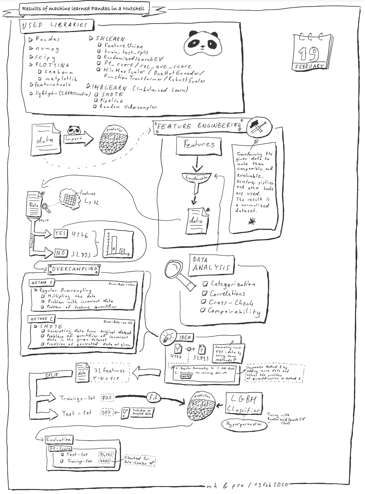

<!--
*** Thanks for checking out this README Template. If you have a suggestion that would
*** make this better, please fork the repo and create a pull request or simply open
*** an issue with the tag "enhancement".
*** Thanks again! Now go create something AMAZING! :D
***
***
***
*** To avoid retyping too much info. Do a search and replace for the following:
*** github_username, repo, twitter_handle, email
-->


<!-- PROJECT SHIELDS -->
<!--
*** I'm using markdown "reference style" links for readability.
*** Reference links are enclosed in brackets [ ] instead of parentheses ( ).
*** See the bottom of this document for the declaration of the reference variables
*** for contributors-url, forks-url, etc. This is an optional, concise syntax you may use.
*** https://www.markdownguide.org/basic-syntax/#reference-style-links
-->
[![Contributors][contributors-shield]][contributors-url]
[![Forks][forks-shield]][forks-url]
[![Stargazers][stars-shield]][stars-url]
[![Issues][issues-shield]][issues-url]
[![MIT License][license-shield]][license-url]
[![LinkedIn][linkedin-shield]][linkedin-url]


<!-- PROJECT LOGO -->
<br />
<p align="center">
  <a href="https://github.com/michaelheichler/predictionchallenge">
  </a>

  <h3 align="center">Prediction Challenge</h3>

  <p align="center">
    Prediction Challenge
    <br />
    <a href="https://github.com/michaelheichler/predictionchallenge"><strong>Explore the docs »</strong></a>
    <br />
    <br />
    <a href="https://github.com/michaelheichler/predictionchallenge/blob/master/PredictionChallenge_Model.ipynb">The Model</a>
    ·
    <a href="https://github.com/michaelheichler/predictionchallenge/blob/master/DataAnalysis.ipynb">The Analysis</a>
    ·
    <a href="https://github.com/michaelheichler/predictionchallenge/issues">Report a Bug</a>
  </p>
</p>


<!-- TABLE OF CONTENTS -->
## Table of Contents

* [About the Project](#about-the-project)
* [Getting Started](#getting-started)
  * [Installation](#installation)
* [Contributing](#contributing)
* [License](#license)
* [Contact](#contact)
* [Acknowledgements](#acknowledgements)


<!-- ABOUT THE PROJECT -->
## About The Project

Welcome on the Git Repository of the Prediction Challenge from Heichler, Michael and Schulte-Austum, Patrick.
In the context of the Prediction Challenge, here you can find the repo and important context on how to deal with a imbalanced dataset.



### Built With

* [Python 3.8.1]()
* [ArchLinux 5.4.22-lts]()


<!-- GETTING STARTED -->
## Getting Started

### Installation
 
1. Clone the repo
```sh
git clone https://github.com/michaelheichler/predictionchallenge.git
```

<!-- LICENSE -->
## License

Distributed under the MIT License. See `LICENSE` for more information.

<!-- CONTACT -->
## Contact

Michael Heichler - michael.heichler@fom-net.de

Project Link: [https://github.com/michaelheichler/predictionchallenge](https://github.com/michaelheichler/predictionchallenge)


<!-- MARKDOWN LINKS & IMAGES -->
<!-- https://www.markdownguide.org/basic-syntax/#reference-style-links -->
[contributors-shield]: https://img.shields.io/github/contributors/michaelheichler/predictionchallenge.svg?style=flat-square
[contributors-url]: https://github.com/michaelheichler/predictionchallenge/graphs/contributors
[forks-shield]: https://img.shields.io/github/forks/michaelheichler/predictionchallenge.svg?style=flat-square
[forks-url]: https://github.com/michaelheichler/predictionchallenge//network/members
[stars-shield]: https://img.shields.io/github/stars/michaelheichler/predictionchallenge.svg?style=flat-square
[stars-url]: https://github.com/michaelheichler/predictionchallenge/stargazers
[issues-shield]: https://img.shields.io/github/issues/michaelheichler/predictionchallenge.svg?style=flat-square
[issues-url]: https://github.com/michaelheichler/predictionchallenge/issues
[license-shield]: https://img.shields.io/github/license/michaelheichler/predictionchallenge.svg?style=flat-square
[license-url]: https://github..com/michaelheichler/predictionchallenge/blob/master/LICENSE.txt
[linkedin-shield]: https://img.shields.io/badge/-LinkedIn-black.svg?style=flat-square&logo=linkedin&colorB=555
[linkedin-url]: https://www.linkedin.com/in/michael-heichler-8b5616192/
[product-screenshot]: PredictionChallenge_OurConceptInANutshell.png

